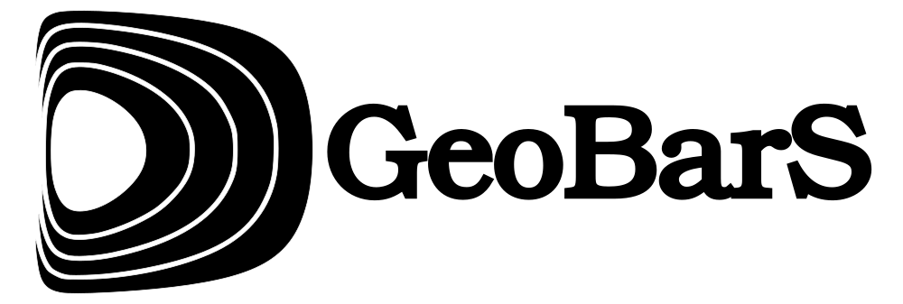
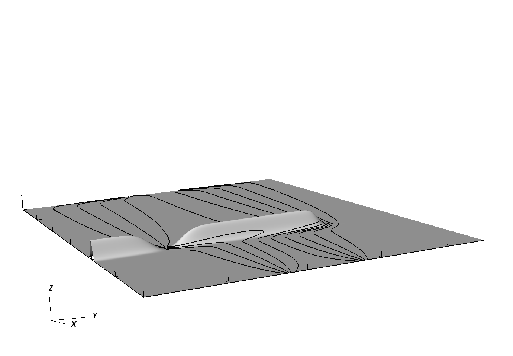
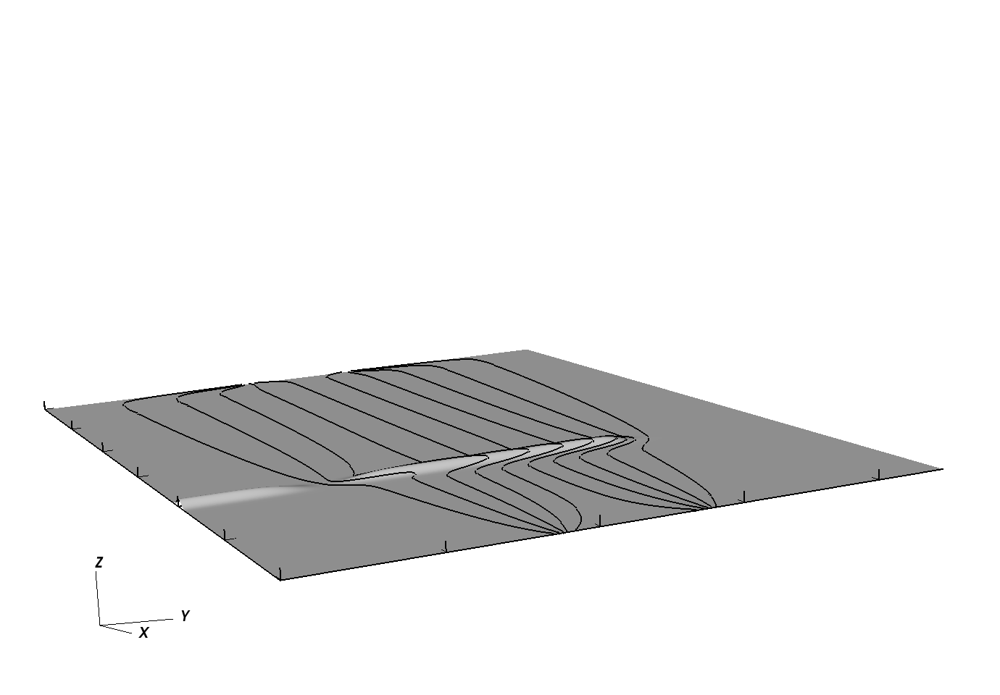

## GeoBarS (Geostrophic Barotropic Vorticity Solver)

GeoBarS is a numerical model that solves the geostrophic and barotropic vorticity equation. These equations are discretized using the Continuous Galerkin Spectral Element Method. The discrete system is inverted using GMRES with restarts (GMRES-m). 

The chosen numerical method permits domain tesselation as an unstructured mesh of quadrilateral elements and exhibits spectral error convergence ( numerical error depends on the smoothness of the exact solution ). The unstructured mesh feature is particularly useful for this equation set, given the natural tendency for westward intensification on a beta-plane as it allows for local mesh refinement in areas where higher resolution is needed.

## Classic "Stommel" Gyre
This example can be found under the `examples/ClassicGyre/` directory in the GeoBarS repository. As in Stommel's 1948 paper on westward intensification, a sinusoidal wind stress drives the circulation on a beta-plane. Bottom drag provides the necessary dissipation for the model to have a well defined steady state. The combination of a varying coriolis parameter, wind stress, bottom drag, and no-normal flow boundary conditions result in the gyre circulation with a western boundary current as shown in the plot below.

## Lau Basin Idealized Abyssal Circulation
This example can be found under the `examples/LauBasinModel/` directory in the GeoBarS repository. This is an idealized model that examine the interactions of steady-state geostrophic and barotropic jets with topography. When the topography blocks the flow, the flow behaves in a manner similar to the island rule that was described in a paper by Joseph Pedlosky. Below are plots of the streamlines along the bottom topography showing two extremes : complete topographic blocking and a jet meander as fluid parcels pass over the ridge and conserve potential vorticity. 

This demo was designed and run by Elizabeth Simons ( @treesquirrel1 ) as part of her dissertation.
